# 铛铛支付

[toc]

## 项目简介

数字货币成为越来越多人的支付方式选择，一个安全高效，功能丰富的资金管理网站可以更好地满足用户的需求，可以让用户更好地管理自己的资金，确认资金明细。

铛铛支付是一个面向企业的兼信息展示，用户管理等的多功能支付平台，为企业的数字化转型赋能。

## 设计思路

根据目前行业流行的架构，结合个人熟悉的开发方式，采用了前后端分离的架构。其中前端负责界面展示部分，为用户提供一个友好的交互体验，后端负责处理业务逻辑，包括支付、订单管理等，为前端提供数据支持。

其中，为了开发的便利，前端使用了 Vue 和 Element UI 等框架和组件库，方便快速开发出美观的、用户友好的使用界面。后端使用了 java 的 servlet 作为 http server 的框架，直接基于已有的 http server 框架进行开发，大大加快了开发速度。此外，后端还使用 mysql 作为数据库，用于保存应用产生的数据，如订单信息、用户信息等。使用 redis 作为缓存，提高了系统的性能和可用性，保存了如分布式锁、热点数据等。使用 minio 作为文件存储，保存了用户上传的文件，如支付凭证、订单合同等。

同时，在设计中，遵循了面向服务的架构（SOA）思想和 MVC 思想，各个业务模块之间通过服务接口进行交互，实现了系统的模块化和可重用性。

最重要的，出于安全的考量，系统在设计和实现中，考虑了各种安全问题，如 SQL 注入、XSS 攻击、CSRF 攻击等，采用了各种安全机制和防护措施，确保了系统的安全性和可靠性。同时用户与服务器交互的过程中全程使用 https 加密，保证了数据的安全性。平台和第三方交互的过程中使用 rsa 签名，保证了交易的安全性。

此外，还考虑到了系统的安全性和可靠性，采用了多种安全机制和故障恢复机制，如故障转移，自动扩缩容等，确保了系统的稳定运行和数据安全。

综上所述，我的项目主要使用了以下技术栈：

**HTTP Server**

- 采用 Java Servlet 构建 RESTful API，提供了统一的接口规范，实现了与客户端的交互。
- 该技术栈的使用实现了项目的核心功能，即在线支付平台的支付处理和订单管理。

**数据库**

- 使用 MySQL 作为项目的数据库管理系统，存储了订单信息、用户信息、支付记录等关键数据。
- 该技术栈的使用实现了项目的数据存储和管理功能，确保了数据的安全和可靠性。

**文件存储**

- 使用自建的 Minio 提供 S3 接口，实现了文件的存储和管理。
- 该技术栈的使用实现了项目的文件存储功能，例如存储支付凭证、订单合同等文件。

**缓存和分布式锁**

- 使用 Redis 作为项目的缓存和分布式锁机制，实现了高性能的数据缓存和并发控制。
- 该技术栈的使用实现了项目的性能优化和高可用性功能，例如缓存热点数据、控制并发支付请求等。

**应用架构**

- 将应用设计为无状态的，实现了应用的水平扩展和高可用性。
- 该技术栈的使用实现了项目的可扩展性和高可用性功能，例如支持高并发支付请求、快速故障恢复等。

**容器化和部署**

- 使用 Kubernetes（K8s）作为项目的容器化和部署平台，实现了自动化的部署、扩展和管理。
- 该技术栈的使用实现了项目的自动化运维和高可用性功能，例如自动扩展容器、滚动更新等。

**高可用性和自动扩展**

- 配置了 Horizontal Pod Autoscaling（HPA），实现了根据负载自动扩展容器的数量。
- 配置了 Service（Svc），实现了服务发现和负载均衡。
- 该技术栈的使用实现了项目的高可用性和自动扩展功能，例如自动扩展容器、负载均衡等。

## 详细功能设计

项目主要由以下功能模块组成

### ApproveService（审计模块）

- 功能：审计模块是一个独立的模块，主要负责审计系统中的各种操作，包括申请审计和审批审计等功能。
- 处理的数据：审计模块处理系统中的操作日志数据，包括操作类型、操作时间、操作人员、操作对象等信息。
- 解决的问题：审计模块可以帮助管理员追踪和监督系统的各种操作，确保系统的安全性和合规性，防止非法操作和数据篡改。

### CaptchaService（验证码模块）

- 功能：验证码模块是一个独立的内部模块，用于生成和验证验证码。
- 处理的数据：验证码模块处理验证码图片数据和用户输入的验证码数据，并进行比对验证。
- 解决的问题：验证码模块可以防止恶意脚本的攻击，保护系统的安全性，确保用户的合法性。

### EventService（日志模块）

- 功能：日志模块构建在权限校验模块之上，负责记录用户的操作日志，用于审计和追踪用户的行为。
- 处理的数据：日志模块处理用户的操作数据，包括操作类型、操作时间、操作对象、操作结果等信息。
- 解决的问题：日志模块可以帮助管理员追踪和分析用户的行为，发现异常活动，并用于审计和合规性检查。

### FriendService（好友模块）

- 功能：好友模块主要处理用户之间的好友关系，包括好友申请、好友列表、好友删除等功能。
- 处理的数据：好友模块处理用户的好友关系数据，包括好友列表、好友申请记录、好友删除记录等。
- 解决的问题：好友模块可以帮助用户管理和维护好友关系，方便用户之间进行互动和沟通。

### GroupService（群组模块）

- 功能：群组模块主要处理用户之间的群组关系，包括群组创建、群组申请、群组列表、群组删除等功能。
- 处理的数据：群组模块处理用户的群组关系数据，包括群组列表、群组成员列表、群组申请记录、群组删除记录等。
- 解决的问题：群组模块可以帮助用户组织和管理多个用户之间的关系，方便用户进行群体沟通和协作。

### LockService（锁模块）

- 功能：锁模块主要用于分布式锁的管理，解决分布式环境下的并发问题。
- 处理的数据：锁模块处理分布式锁的数据，包括锁的名称、锁的状态、锁的持有者等信息。
- 解决的问题：锁模块可以帮助系统避免分布式环境下并发操作导致的数据冲突和一致性问题，确保数据的安全性和一致性。

### MailService（邮件模块）

- 功能：邮件模块是一个独立的内部模块，用于发送邮件。
- 处理的数据：邮件模块处理邮件数据，包括收件人地址、邮件内容、邮件主题等信息。
- 解决的问题：邮件模块可以帮助系统与用户进行沟通和通知，例如发送注册验证邮件、密码重置邮件等。

### MessageService（消息模块）

- 功能：消息模块主要处理用户之间的消息发送和接收功能。
- 处理的数据：消息模块处理用户的消息数据，包括消息内容、消息发送时间、消息发送者、消息接收者等信息。
- 解决的问题：消息模块可以帮助用户之间进行实时沟通和互动，增强用户之间的联系和互动性。

### RBACService（权限模块）

- 功能：权限模块负责全站的权限校验和管理，包括用户权限和角色权限的校验和分配。
- 处理的数据：权限模块处理用户权限和角色权限的数据，包括用户角色、角色权限、权限分配记录等。
- 解决的问题：权限模块可以帮助系统实现细粒度的权限控制，确保系统的安全性和数据的保密性，防止未经授权的访问和操作。

### TransactionService（交易模块）

- 功能：交易模块处理平台之间的交易，以及生成收款码和处理用户扫描等事件。
- 处理的数据：交易模块处理交易数据，包括交易金额、交易时间、交易对象、交易状态等信息。
- 解决的问题：交易模块是平台的核心功能，可以帮助用户进行安全和便捷的交易，确保交易的准确性和安全性。

### UploadService（上传模块）

- 功能：上传模块用于转发用户上传的文件到云存储，并生成文件的下载链接。
- 处理的数据：上传模块处理文件上传数据，包括文件名称、文件大小、文件类型、上传时间等信息。
- 解决的问题：上传模块可以帮助用户存储和管理非结构化数据，方便用户共享和访问文件。

### UserService（用户模块）

- 功能：用户模块主要处理用户的注册、登录、信息修改等功能。
- 处理的数据：用户模块处理用户数据，包括用户名称、密码、联系方式、个人信息等。
- 解决的问题：用户模块是系统的核心模块，可以帮助系统管理和认证用户，确保系统的安全性和可用性。

### WalletService（钱包模块）

- 功能：钱包模块主要处理用户的钱包信息，包括余额、交易记录、子钱包分配等。
- 处理的数据：钱包模块处理用户的钱包数据，包括余额、交易记录、子钱包信息等。
- 解决的问题：钱包模块可以帮助用户管理和追踪资金流水，确保资金的安全性和透明性。

## 项目功能

项目主要有主页，群组，钱包，私聊，交易记录，审计日志六个页面组成。

#### 主页

主页有注册，登录，注销登录，以及登录之后查看和修改个人信息的功能。

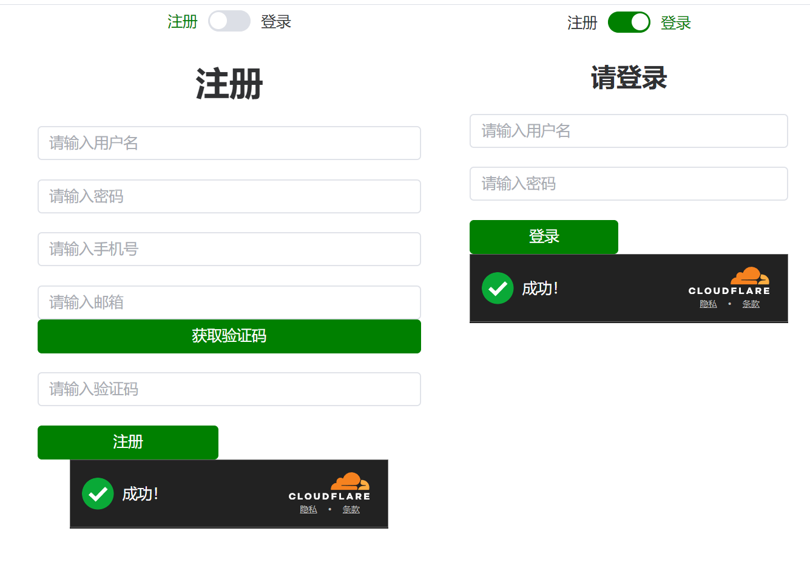

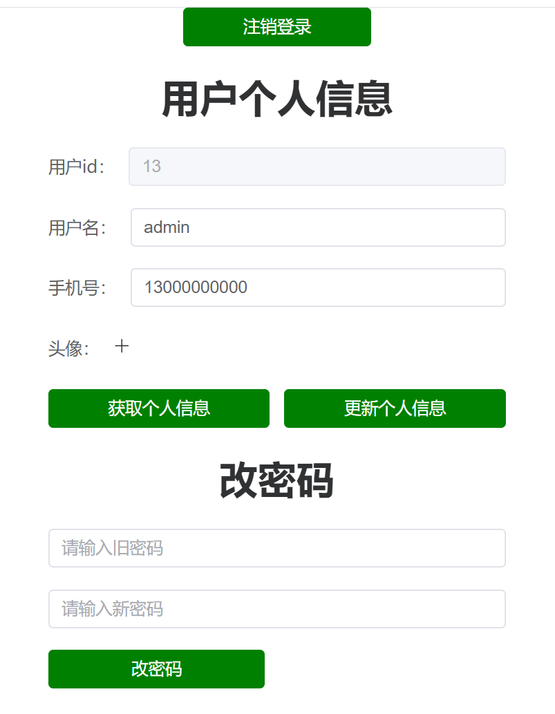

#### 群组页面

有查看群组列表，创建群组和查看我的群组功能。

创建群组将会向网站管理员发送申请，管理员审批通过即成功创建群组。

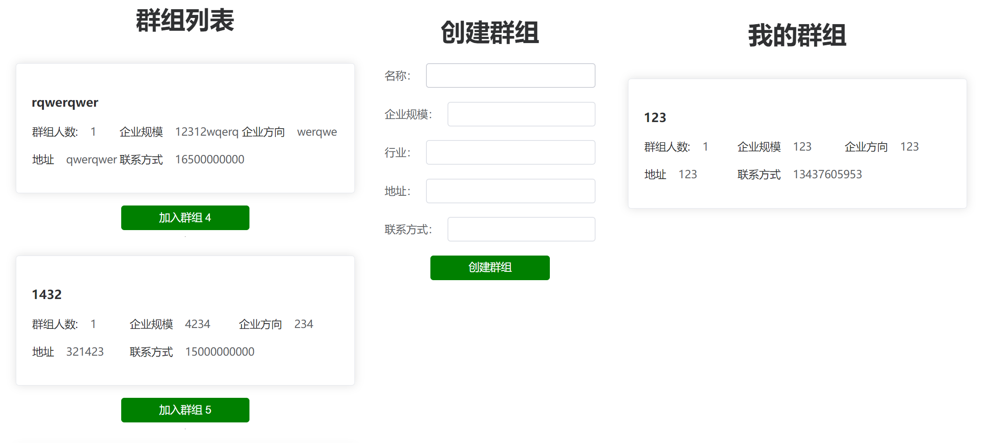

网站管理员会比普通用户多出来可以封禁群组和解封群组的功能，被封禁的群组无法做任何操作，同时群组钱包会被冻结，无法进行交易，只能由群组管理员向网站管理员申请解封。

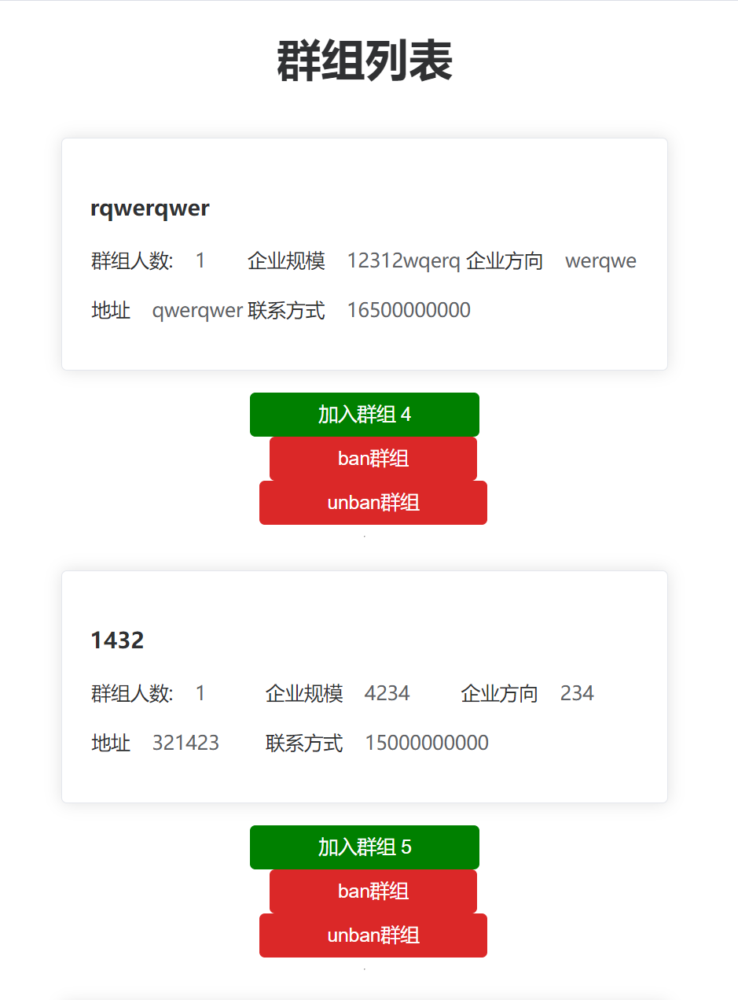

##### 群组详细页面

用户可以查看自己的群组的详细信息

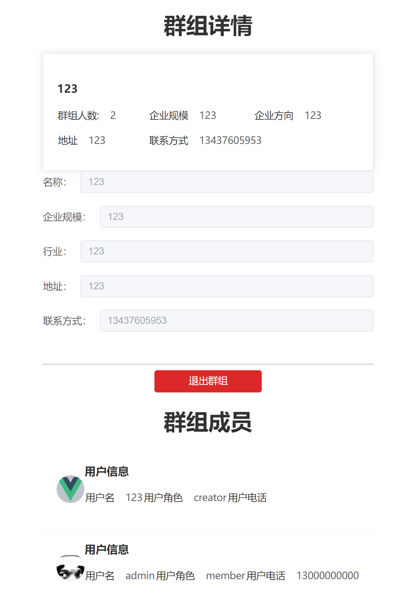

群组管理员会比普通的群组成员多出管理方面的功能

.png)

群组的钱包系统分为群组主钱包和群组子钱包，主钱包归属于群组，不属于任何个人，无法使用群组主钱包直接对外进行交易。群组管理员可以给群组成员分配群组子钱包，子钱包归属于个人，和个人钱包一样，可以进行任何交易，同时可以接受群组主钱包分配和收回资金。如果群组管理员希望给其他成员分配资金，则可以给对应的群组子钱包转钱，然后讲自己的子钱包的钱转移到群组主钱包里，然后再用群组主钱包划分资金给需要分配的用户的群组子钱包。

#### 钱包页面

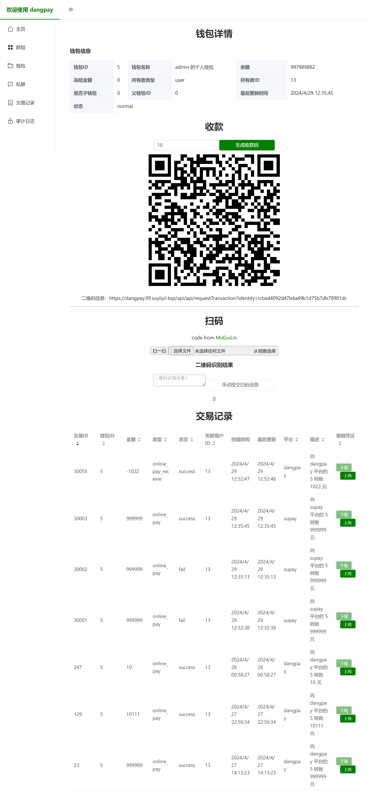

钱包界面可以看到钱包的详细信息，可以生成收款二维码，可以扫描其他用户提供的收款二维码，可以查看该钱包的交易记录

#### 私聊页面

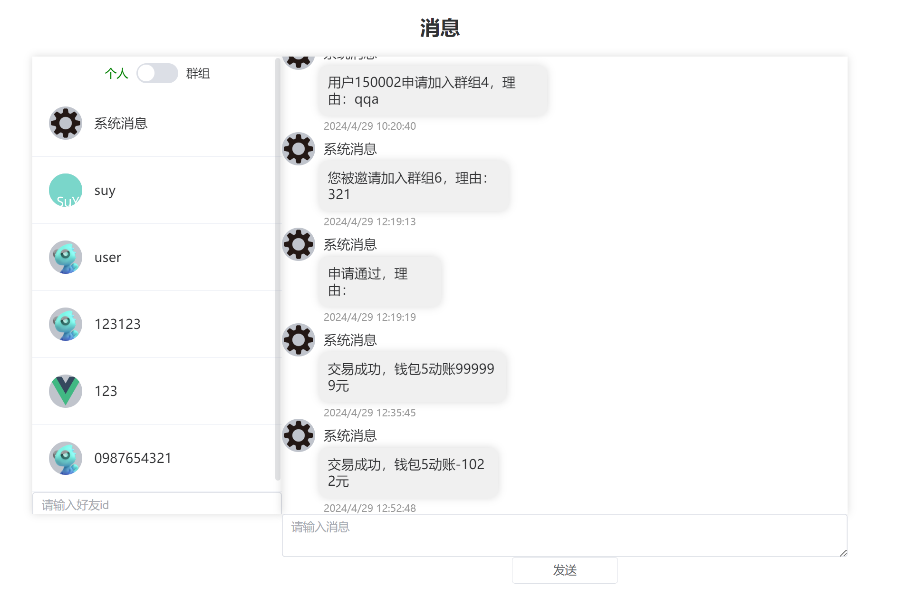

用户可以在这里接收和处理系统通知，和其他用户以及群组内聊天

#### 全局交易记录

管理员可以在这个页面看到站内的所有交易记录，便于监管。

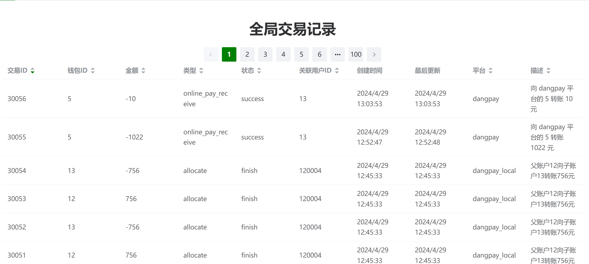

#### 审计日志

管理员可以查看全站的审计日志，便于查找恶意用户。

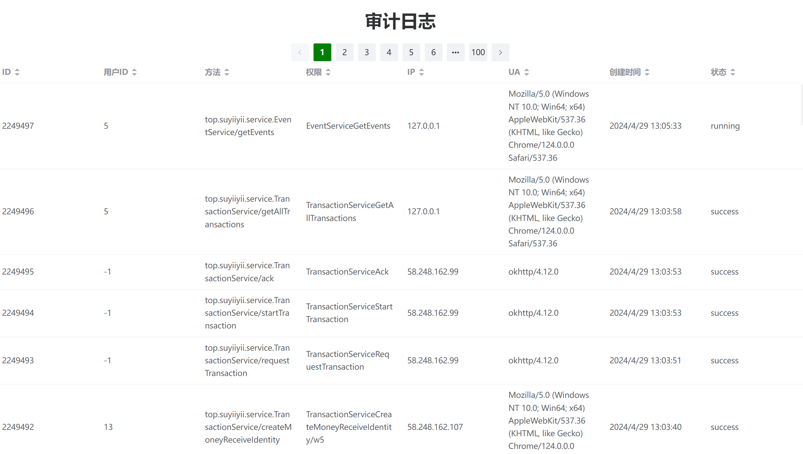

## 项目亮点

### 项目代码亮点

#### 连接池

自己实现了 jdbc 的连接池，可以适配不同的数据库驱动，通过多线程实现高效的连接分配和收回操作，大大提高了连接的复用率，加速数据库操作，同时为 orm 框架的完成奠定基础。

#### ORM

自己实现了一个简单的 orm 框架，具有自动根据实体类创建对应的数据库表，语义化的增删差改操作，批量插入对象，自动追踪被修改的元素并自动更新到数据库等功能。语句的执行起和查询条件的构造器使用回调函数实现了分离，并且支持链式调用，扩展性强。使用简单的 java 对象操作即可实现操作数据库，大大的提高了开发的效率。

```java
// 获取Session
Session db = modelManger.getSession();
// 单个查询
Student student = db.query(Student.class).eq("studentid", studentid).first();
// 批量查询
List<Student> list = db.query(Student.class).limit(page, size).all();

// 单个插入
student.studentid = "ididid";
student.grade = 1000;
db.insert(student);

// 批量插入
List<Student> students;
for (int i = 0; i < 10; i++) {
     db.add(student);
}
db.commit();

// 更新
student = db.query(Student.class).eq("studentid", studentid).first();
student.grade = 999;
db.commit();

// 删除
db.query(Student.class).eq("studentid", studentid).delete();
```

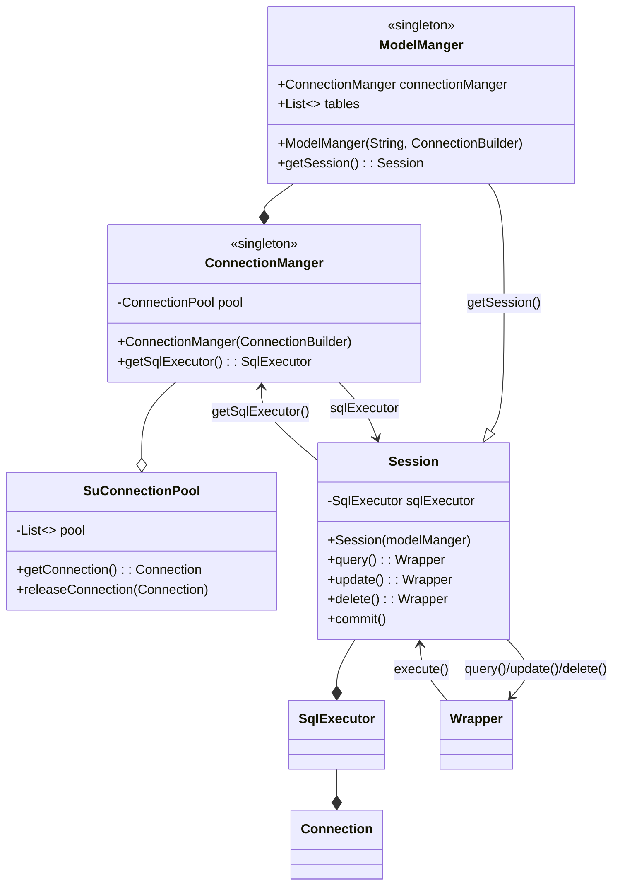
```mermaid
classDiagram
%%    ConnectionManger *-- ModelManger
    class ModelManger {
        <<singleton>>
        +ModelManger(String, ConnectionBuilder)
        +getSession(): Session
        +ConnectionManger connectionManger
        +List<> tables
    }

    class ConnectionManger {
        <<singleton>>
        +ConnectionManger(ConnectionBuilder)
        +getSqlExecutor(): SqlExecutor
        -ConnectionPool pool
    }

    class SuConnectionPool {
        -List<> pool
        +getConnection(): Connection
        +releaseConnection(Connection)
    }

    class Session {
        +Session(modelManger)
        +query(): Wrapper
        +update(): Wrapper
        +delete(): Wrapper
        +commit()
        -SqlExecutor sqlExecutor
    }

    ModelManger --* ConnectionManger
    ModelManger --|> Session: getSession()
    Session --* SqlExecutor
    SqlExecutor --* Connection
    Session --> ConnectionManger: getSqlExecutor()
    ConnectionManger --> Session: sqlExecutor
    ConnectionManger --o SuConnectionPool
    Session --> Wrapper: query()/update()/delete()
    Wrapper --> Session: execute()
```

#### IOC/DI/AOP

自己实现了一个简单的 IOC 容器，支持依赖注入和创建代理对象。

- 支持对象的生命周期管理，构建时自动注入需要的参数，销毁时调用 destroy 方法优雅的释放占用的资源。
- 支持构造器注入，自动构建构造方法需要的对象，如果有嵌套则递归构建。
- 支持 AOP 编程，支持在构造对象时注入被代理的对象，在不修改原来代码的情况下，在调用对象的方法的时候插入新的逻辑。以此为基础实现了 rbac 权限认证和统一的审批系统以及声明式事务和锁。
- 使用注解优化上述过程，使得代码更加优雅。

#### RBAC

使用基于 AOP 的带有分组拓展的 RBAC 权限认证系统。

- 权限认证整体框架基于 RBAC，给不同的用户分配不同的角色。为了更好的应对群组关系，个人在 rbac 的基础上拓展了分组系统，用户将会被分配一个带有分组的角色，该角色只有操作分组内资源的的权限。
- 基于 AOP，在方法被执行之前自动使用用户身份和用户的角色进行权限校验，无需在方法内部添加额外的代码。

#### 审批系统

基于 AOP 实现统一的审批系统，无需更改接口即可将旧接口改为需要审批。
实现原理：

- 在权限校验的时候设置断点，记录请求的方法和参数，保存请求的原因后直接返回，告知用户请求已提交，等待审批
- 给审批人发送通知，审批人可以看到请求的原因，审批通过后，再执行操作
- 审批的消息带有一个回调地址，审批通过，前端调用回调地址，后端执行操作
- 通过请求的方法和参数，再次调用一次请求，但是这次不会再次进入权限校验，直接执行操作，不会再走请求流程

#### 子钱包设计

群组给用户分配资金，抽象为用户获得群组子钱包，子钱包同为钱包，可以正常与其他账户进行交易。

#### 声明式事务和锁

一行注解，即可给当前方法开启事务或锁

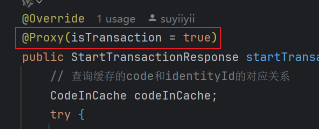

#### 交易协议

基于开放共赢的理念，我设计了一套开放的通用的跨平台的交易 api，在保证交易安全的前提下可以实现跨多平台的安全互信，为平台发展提供了更多可能性。

##### 网上付款

###### 场景

- 用户网上购物，下订单后网页弹出二维码，用户使用铛铛支付扫描二维码直接提示金额，身份认证通过后付款

收款方生成二维码，给定金额，付款方扫描二维码进行付款

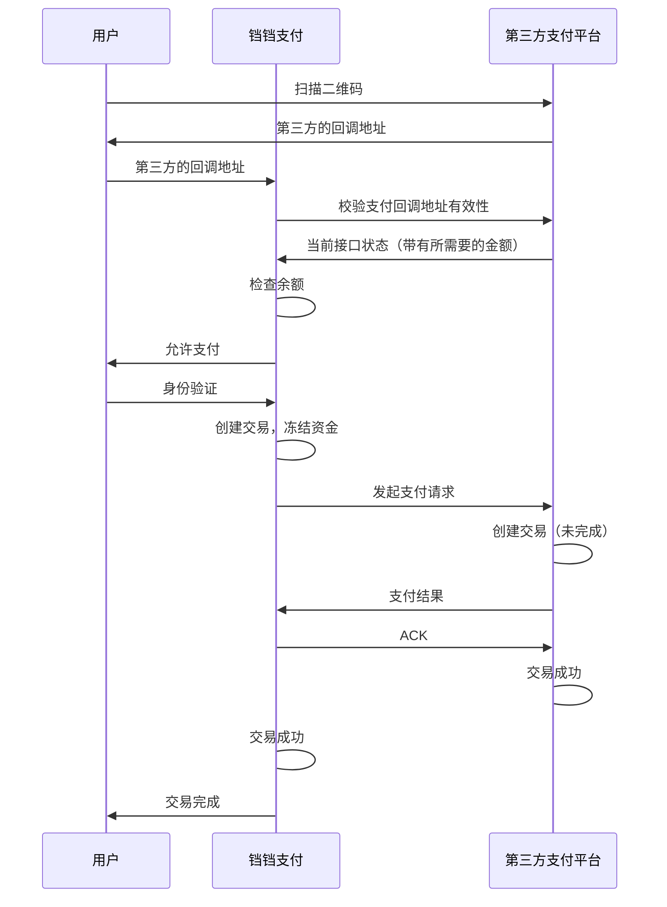
```mermaid
sequenceDiagram
    participant A as 用户
    participant B as 铛铛支付
    participant C as 第三方支付平台
    A ->> C: 扫描二维码
    C ->> A: 第三方的回调地址
    A ->> B: 第三方的回调地址
    B ->> C: 校验支付回调地址有效性
    C ->> B: 当前接口状态（带有所需要的金额）
    B -> B: 检查余额
    B ->> A: 允许支付
    A ->> B: 身份验证
    B -> B: 创建交易，冻结资金
    B ->> C: 发起支付请求
    C -> C: 创建交易（未完成）
    C ->> B: 支付结果
    B ->> C: ACK
    C -> C: 交易成功
    B -> B: 交易成功
    B ->> A: 交易完成
```

##### 收款码

###### 场景

- 项目作者在宿舍门口卖炒粉，贴一张收款码在门口，用户使用铛铛支付扫描收款码，手动输入金额，身份认证通过后付款

收款方生成收款码，付款方扫描收款码进行付款

收款码付款，用户使用铛铛支付扫描第三方支付平台的收款码，手动输入金额，进行付款

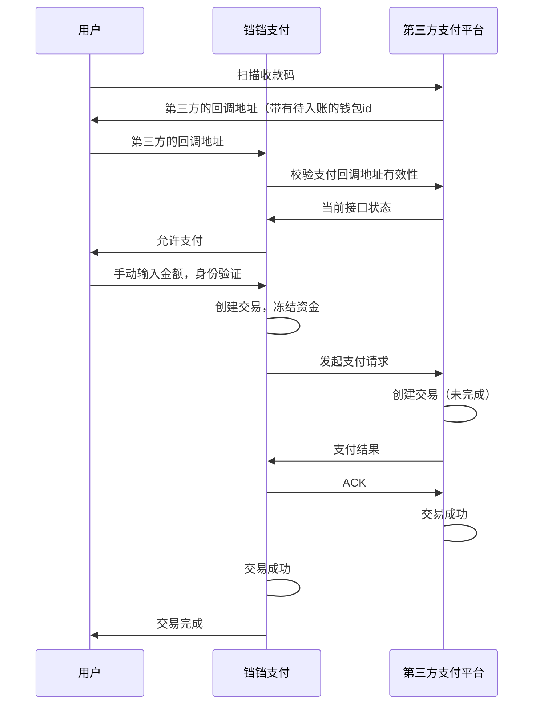
```mermaid
sequenceDiagram
    participant A as 用户
    participant B as 铛铛支付
    participant C as 第三方支付平台
    A ->> C: 扫描收款码
    C ->> A: 第三方的回调地址（带有待入账的钱包id
    A ->> B: 第三方的回调地址
    B ->> C: 校验支付回调地址有效性
    C ->> B: 当前接口状态
    B ->> A: 允许支付
    A ->> B: 手动输入金额，身份验证
    B -> B: 创建交易，冻结资金
    B ->> C: 发起支付请求
    C -> C: 创建交易（未完成）
    C ->> B: 支付结果
    B ->> C: ACK
    C -> C: 交易成功
    B -> B: 交易成功
    B ->> A: 交易完成
```

##### 付款码

###### 场景

- 用户去超市购物，收银员输入金额，用户使用铛铛支付，在身份认证之后出示付款码，收银员扫描付款码，此时不需要身份验证，直接付款

付款方生成付款码，收款方扫描付款码进行收款

付款码收款，用户设置收款金额，使用铛铛支付扫描第三方支付平台的付款码，进行收款

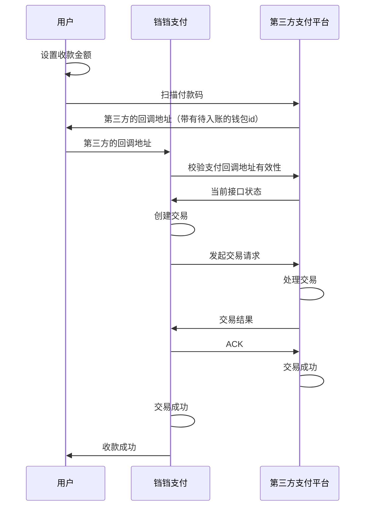
```mermaid
sequenceDiagram
    participant A as 用户
    participant B as 铛铛支付
    participant C as 第三方支付平台
    A ->> A: 设置收款金额
    A ->> C: 扫描付款码
    C ->> A: 第三方的回调地址（带有待入账的钱包id）
    A ->> B: 第三方的回调地址
    B ->> C: 校验支付回调地址有效性
    C ->> B: 当前接口状态
    B -> B: 创建交易
    B ->> C: 发起交易请求
    C -> C: 处理交易
    C ->> B: 交易结果
    B ->> C: ACK
    C -> C: 交易成功
    B -> B: 交易成功
    B ->> A: 收款成功
```

##### Api

###### Post /requestTransaction?identity=xxx

请求交易，返回当前接口的状态和回调地址

identity 是二维码的标识，应该是唯一且随机的

###### Request

####### header

```header
X-Signature: string
```

####### body

```json
{
  "platform": "string",
  "requestId": "string"
}
```

header 应该包含一个签名，签名内容为 body 的 json 字符串，签名算法为 rsa，私钥由铛铛支付平台持有，公钥由第三方支付平台持有

###### Response

####### success(未指定金额)

```json
{
  "status": "success",
  "callback": "/startTransaction?code=xxx",
  "isAmountSpecified": false,
  "payeeName": "string",
  "requestId": "string"
}
```

####### success(指定金额)

表示希望对方转给自己的钱，正数为收款，负数为付款（主体为响应方）

```json
{
  "status": "success",
  "message": "success",
  "platform": "string",
  "callback": "/startTransaction?code=xxx",
  "isAmountSpecified": true,
  "specifiedAmount": 100,
  "payeeName": "string",
  "requestId": "string"
}
```

code 是表示交易对象的标识，应该是在收到对方的交易请求后生成的，应该是系统临时生成且具有有效期的

介绍到请求之后应返回相同的 requestId，标记请求和响应，便于后续的交易记录查询

####### error

```json
{
  "status": "error",
  "message": "error message",
  "requestId": "string"
}
```

##### Post /startTransaction?code=xxx

开始交易，表示希望转给对方的金额，正数为支付，负数为收款（主体为请求方）

###### Request

```json
{
  "platform": "string",
  "tradeDescription": "string",
  "payeeName": "string",
  "amount": 100,
  "requestId": "string"
}
```

###### Response

####### success

```json
{
  "status": "success",
  "message": "交易成功",
  "callbackUrl": "string",
  "requestId": "string"
}
```

####### error（code 不存在或已过期）

```json
{
  "status": "error",
  "message": "code不存在或已过期",
  "requestId": "string"
}
```

##### Post /ack?code=xxx

为确保平台成功收到交易的响应，需要确认交易
确认交易
无请求体，响应 200 即可

如果 ack 请求失败，需要重发 ack，或者等待管理员处理

### 项目开发亮点

#### 应用程序的无状态

简单介绍架构演进过程

##### 原始的单体架构

应用服务器需要处理客户端的各种请求，可能需要长期保存文件或者临时保存文件，一般数据库会独立出来部署到其他地方，但是其他数据一般都会保存在本地。

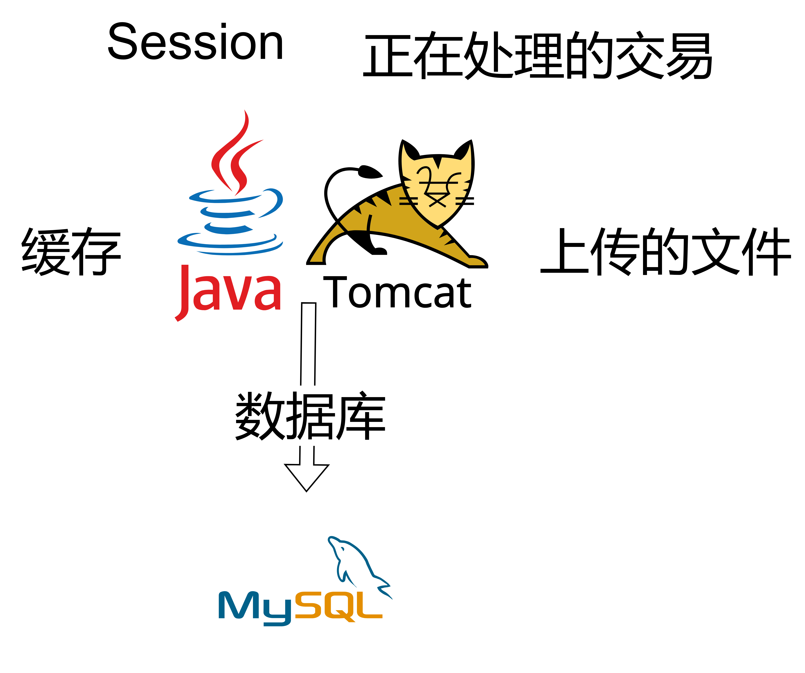

##### 职能外包

可以将不同的功能转移给专用的中间件进行处理，可以讲应用本体无状态化。

.png)

##### 容器化

由于应用服务器不再需要本地存储数据，所以可以将应用服务器打包成容器镜像。

.png)

##### 集群部署

应用保持无状态后并使用容器打包后，便可以很方便的横向扩容，可以使用编排平台进行集群部署。

.png)

#### 项目架构

项目整体架构如下，整体部署在 kubernetes 集群上。

##### 应用

- 应用使用 tomcat 容器为基础，容器化部署。

##### 中间件

- **TiDB** 数据库中间件，提供结构化数据存储的能力，以兼容 `mysql 8.0` 的接口的形式提供服务，用于存储平台产生的绝大多数数据。
- **Redis** 缓存中间件，提供快速的的内存 kv 数据库的能力，用于临时存储邮箱验证码，交易凭据等临时数据。
- **MinIO** 存储中间件，提供高效存储非结构化数据的能力，用户存储用户上传的头像等二进制文件，以 `S3`兼容接口的形式提供。

##### 负载均衡

- **traefik** 网络路由中间件，为集群提供负载均衡功能。

##### 容器编排

- **Kubernetes** 容器编排平台，它提供了自动化部署、扩展和管理容器化应用程序的能力，并且可以无缝地扩展或缩减应用程序的实例数量。

.png)

#### GitOps 工作流

项目使用 GitOps 工作流，程序运行环境也使用代码定义，实现基础架构即代码(IaC) ，从而将基础架构的配置和管理自动化，提高了开发效率和系统可靠性。同时，GitOps 工作流还提供了版本控制和回退机制，确保了系统的稳定性和可追溯性。

.png)

### 项目功能亮点

#### 全局审计日志

系统在做权限认证的同时会记录用户信息以及认证结果和请求相关信息并存储到数据库中，可以分析用户行为，识别恶意请求。

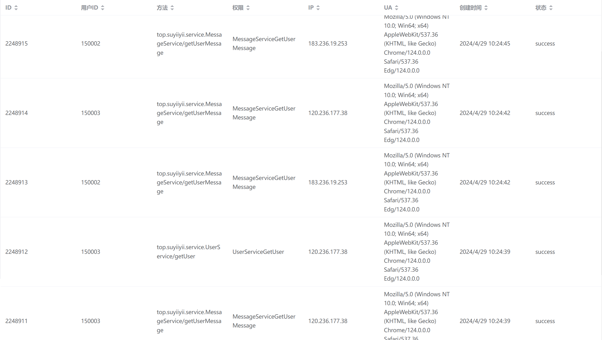

#### HTTPS

用户请求从浏览器到中转服务器到应用服务器，全程 `HTTPS/TLS` 加密。

.png)

#### RSA 签名

平台之间交互必须使用私钥对请求体进行签名，接收交易请求方将会使用内置的公钥尝试验签，如签名不存在或验签失败，则拒绝响应。

.png)

#### 二维码支付

平台支持扫描二维码和生成二维码，极大的提高了支付的便利性。

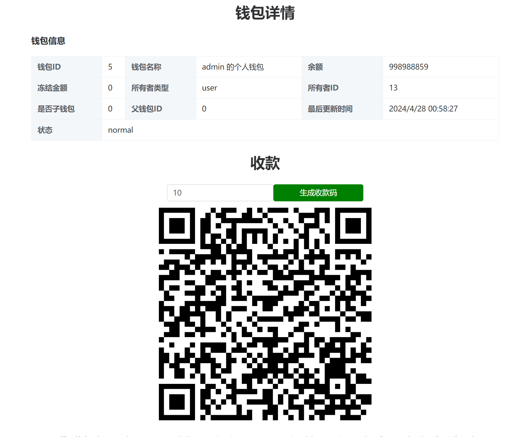

### 还有亿些项目亮点

- 邮箱验证码
- 人机验证码
- Jwt 做登录状态
- 支持用户上传自己的头像和文件
- 全程日志记录
- 全自动参数校验
- 统一异常处理
- 使用 Apifox 记录接口信息
- 抵御 Sql 注入、Xss 攻击
- 数据库用户密码加盐存储
- Git 使用双分支开发，dev 分支定时合并到主分支
- Git 提交粒度小
- ……

## 项目难点

### 第三方是什么

如果是类似于支付宝/微信支付的第三方，那么请求支付需要跳转到第三方平台，并且使用第三方的账号系统，使用第三方的资金。那么我的平台作为一个支付平台似乎就显得不那么重要了。

所以我根据调用第三方接口这个底线，将我自己的平台作为中心，提供了一套可以与其他支付平台进行交易的接口。用户支付时仍然使用我方平台，与第三方平台的交互将由我方服务器自己实现，这样隔离了用户和第三方，用户无需知晓第三方平台的存在，无需用户拥有第三方平台的账号，无需在第三方平台上面存款也可以与第三方平台上面的账户进行交易。

### 怎么验证第三方的身份

由于对外界提供了通用的交易接口，任何人都可以直接请求接口进行交易，如果不对请求进行限制的话，那么任何人都可以随意转走平台上面的钱。所以需要验证第三方的身份。

因此引申出来怎么验证第三方的身份的问题。

首先，最简单的方式就是和第三方使用专线连接，这样就可以保证数据的安全性，但是这样的方式成本太高，不适合大规模的应用，同时也不满足平台开放的需求。

其次，可以使用ip白名单，只有在白名单内的ip才能访问接口，这样可以保证只有第三方的服务器才能访问接口，可以简单的解决问题，但是这样的方式不够灵活，不适合大规模的应用。

最后，可以使用签名的方式，第三方在请求接口的时候，需要使用自己的私钥对请求体进行签名，接收交易请求方将会使用内置的公钥尝试验签，如签名不存在或验签失败，则拒绝响应。这样的方式可以保证数据的安全性，同时也可以保证平台的开放性。

## 心得体会

这次项目非常的时间紧任务重，到目前为止还有很多没有完成的内容，但通过这次项目，我学到了许多宝贵的经验和知识。从项目的设计到实现，从技术选型到架构设计，每一个步骤都让我收获了很多。

在这个项目中，我深入了解了云原生架构的设计理念和实现方法，熟悉了 Kubernetes、Redis、S3 等技术的使用和配置。同时，我也学习到了如何设计和实现高可用、高性能的系统，如何进行性能优化和故障恢复。

在这里，我要特别感谢师兄吗，他们提供了宝贵的指导和支持，帮助我克服了许多技术难题和项目挑战。他们的经验和建议让我受益匪浅，我将永远感激他们的帮助和支持。

总之，这次项目让我成长了很多，让我学到了许多新的技术和经验，也让我更好地了解了自己的能力。我将继续努力，继续学习和成长，创造更多的价值。
