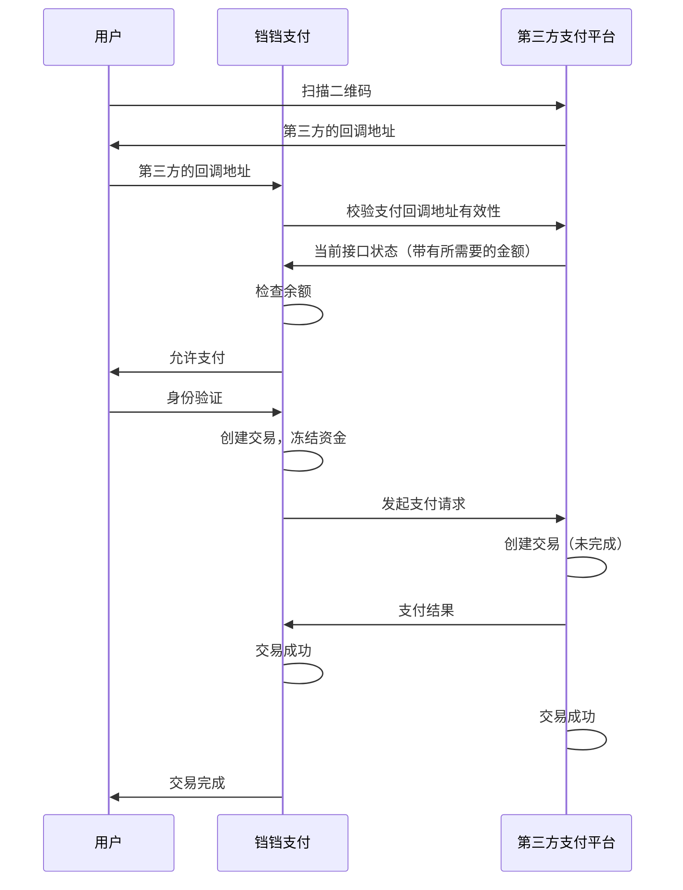
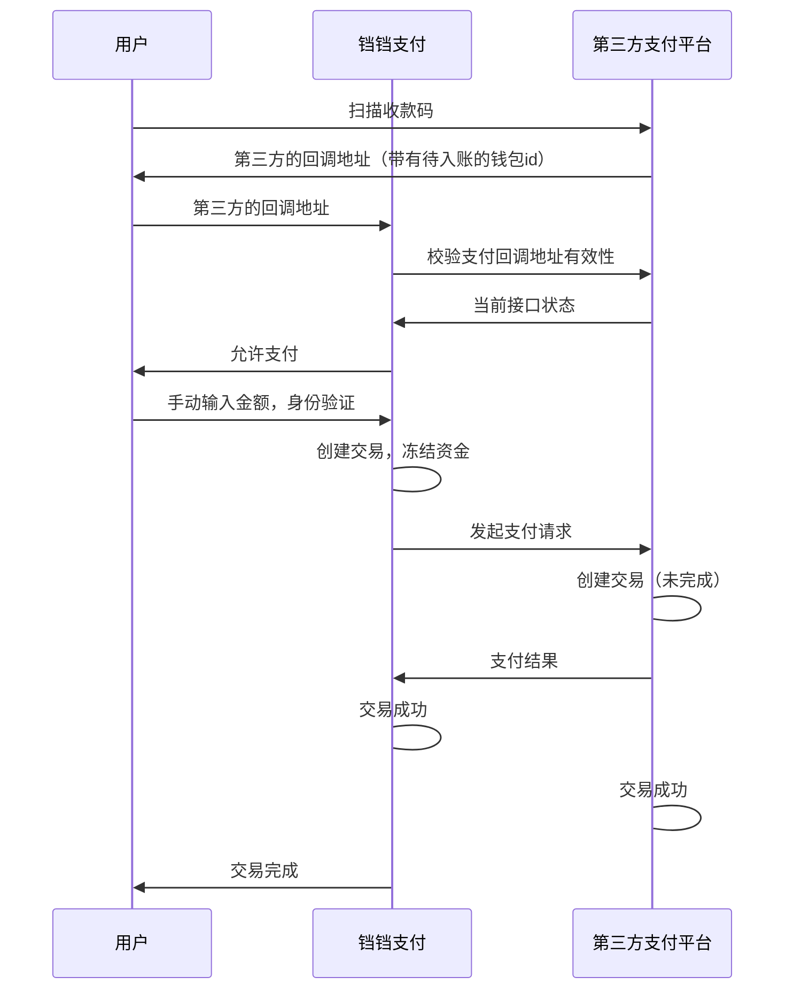
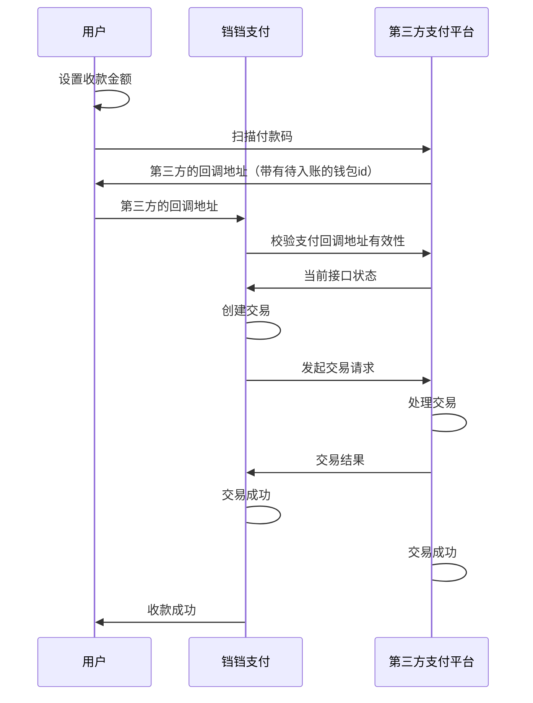

# 铛铛支付

一个面向企业的兼信息展示，用户管理等的多功能支付平台

## 主线规划

- [x] **健康检查**  (2024年04月14日)
- [x] **集群部署** (2024年04月14日)
- [x] **CI/CD** (2024年04月14日)
- [x] **IOC/DI** (2024年04月15日)
- [x] **统一的参数校验** (2024年04月15日)
- [x] **用户管理**  (2024年04月15日)
- [x] **rbac权限管理** (2024年04月15-16日)
- [x] **群组信息管理** (2024年04月16日)
- [x] **信息展示** (2024年04月16日)
- [x] **企业管理** (2024年04月16日)
- [x] **群组成员管理（邀请入群）**(2024年04月17日)
- [ ] **钱包功能**
- [ ] **群组钱包分配给用户**
- [ ] **多钱包管理**
- [ ] **交易api**
- [ ] **交易记录**
- [ ] **交易记录导出**
- [ ] **交易记录统计**
- [ ] **使用RabbitMQ，实现订单过期功能**

## 低优先级规划

- [ ] **分页显示**
- [ ] **搜索功能**
- [ ] **交易记录分析**

## 支付流程

### 网上付款

#### 场景

* 用户网上购物，下订单后网页弹出二维码，用户使用铛铛支付扫描二维码直接提示金额，身份认证通过后付款

收款方生成二维码，给定金额，付款方扫描二维码进行付款



### 收款码

#### 场景

* 项目作者在宿舍门口卖炒粉，贴一张收款码在门口，用户使用铛铛支付扫描收款码，手动输入金额，身份认证通过后付款

收款方生成收款码，付款方扫描收款码进行付款

收款码付款，用户使用铛铛支付扫描第三方支付平台的收款码，手动输入金额，进行付款



### 付款码

#### 场景

* 用户去超市购物，收银员输入金额，用户使用铛铛支付，在身份认证之后出示付款码，收银员扫描付款码，此时不需要身份验证，直接付款

付款方生成付款码，收款方扫描付款码进行收款

付款码收款，用户设置收款金额，使用铛铛支付扫描第三方支付平台的付款码，进行收款



## Api

### GET /requestTransaction?key=xxx

请求交易，返回当前接口的状态和回调地址

#### Response

##### success(未指定金额)

```json
{
  "status": "success",
  "callback": "/startTransaction?code=xxx",
  "isSpecifiedAmount": false
}
```

##### success(指定金额)

表示希望对方转给自己的钱，正数为收款，负数为付款（主体为响应方）

```json
{
  "status": "success",
  "Platform": "string",
  "callback": "/startTransaction?code=xxx",
  "isSpecifiedAmount": true,
  "sepecifiedAmount": 100
}
```

##### error

```json
{
  "status": "error",
  "message": "error message"
}
```

### POST /startTransaction?code=xxx

开始交易，表示希望转给对方的金额，正数为支付，负数为收款（主体为请求方）

#### Request

```json
{
  "Platform": "string",
  "tradeName": "string",
  "payeeName": "string",
  "amount": 100
}
```

#### Response

##### success

```json
{
  "status": "success",
  "message": "交易成功"
}
```

##### error

```json
{
  "status": "error",
  "message": "error message"
}
```

## 群组钱包管理

* 群组可以有自己的钱包
* 钱包内的钱分为可用余额和冻结余额，管理员可以
* 管理员可以把钱包内的钱分配给群组成员，分配出去的部分将会显示为已冻结，群组成员会获得一个来自该群组的子钱包
* 子钱包可以和普通钱包一样进行交易，交易结束后会刷新群组钱包的余额

## Q&A

* 怎么处理内部转账？
    * 内部转账是指用户之间的转账，不涉及第三方支付平台
    * 因为做的接口是通用的，所以内部转账也是通过对外的接口进行的
* 怎么实现第三方支付平台的支付？
    * 因为接口是通用的，所以再起一个铛铛支付实例就是第三方支付平台了
* 支付的理解
    * 支付是用户通过铛铛支付平台，与其他平台进行转账，交易成功后一个平台钱减少，另一个平台钱增加，但两个平台上的资产之和不变


