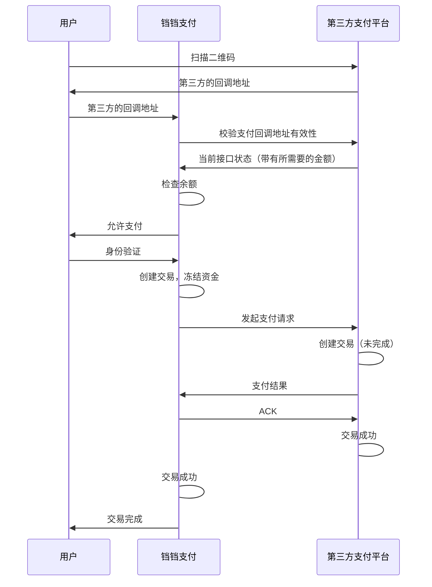
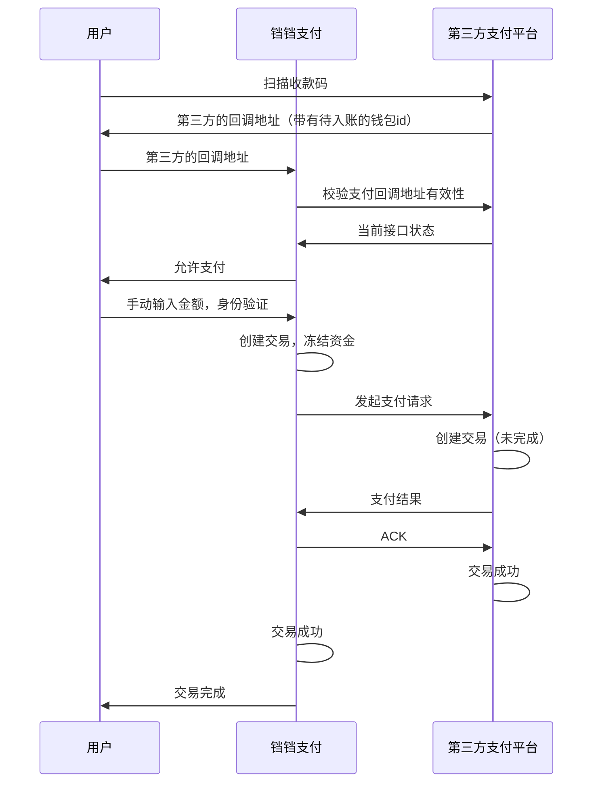
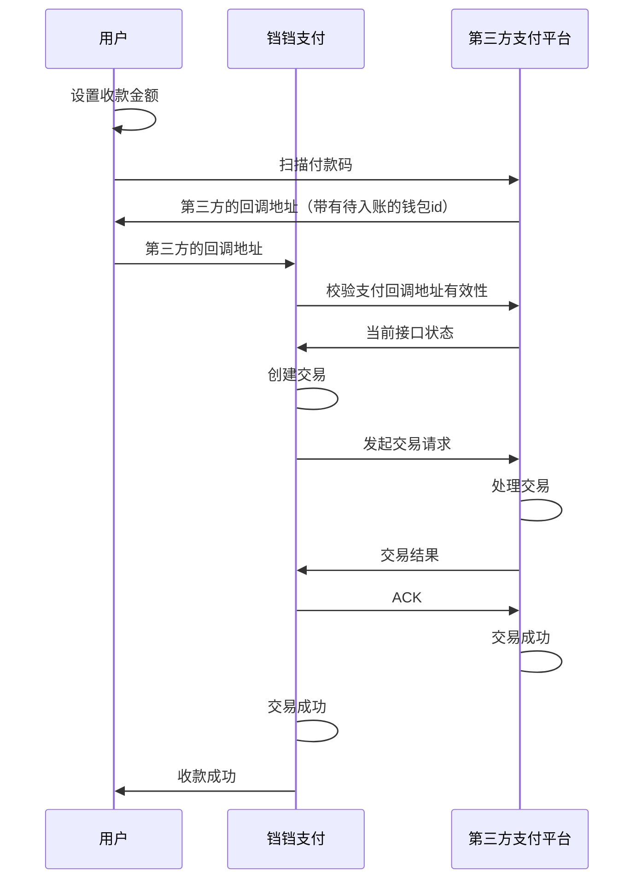

# Tips
该项目为参与校内工作室的考核项目

# 铛铛支付

一个面向企业的兼信息展示，用户管理等的多功能支付平台

## 主线规划

- [x] **健康检查**  (2024年04月14日)
- [x] **集群部署** (2024年04月14日)
- [x] **CI/CD** (2024年04月14日)
- [x] **IOC/DI** (2024年04月15日)
- [x] **统一的参数校验** (2024年04月15日)
- [x] **用户管理**  (2024年04月15日)
- [x] **rbac权限管理** (2024年04月15-16日)
- [x] **群组信息管理** (2024年04月16日)
- [x] **信息展示** (2024年04月16日)
- [x] **企业管理** (2024年04月16日)
- [x] **群组成员管理（邀请入群）** (2024年04月17日)
- [x] **多实例部署** (2024年04月18日)
- [x] **钱包功能** (2024年04月19日)
- [x] **群组钱包分配给用户** (2024年04月19日)
- [x] **多钱包管理** (2024年04月19日)
- [x] **扫码功能** (2024年04月19日)
- [x] **和第三方平台交互** (2024年04月19日)
- [x] **rsa签名和验签** (2024年04月20日)
- [x] **交易api** (2024年04月20日)
- [x] **网上支付** (2024年04月20日)
- [x] **多实例之间的验证和交互** (2024年04月21日)
- [ ] **收款码**
- [ ] **付款码**
- [x] **交易记录** (2024年04月19日)
- [ ] **交易记录导出**
- [x] **交易记录统计** (2024年04月26日)
- [ ] **使用RabbitMQ，实现订单过期功能**
- [x] **用户消息功能** (2024年04月22日)
- [x] **群组消息功能** (2024年04月22日)
- [x] **通过AOP的方式实现审批功能** (2024年04月23日)
- [x] **S3文件上传** (2024年04月24日)
- [x] **头像自定义** (2024年04月24日)
- [x] **被封禁的钱包不能进行操作** (2024年04月25日)
- [x] **被封禁的群组不能进行操作** (2024年04月25日)
- [x] **被封禁的群组的群主可以申请取消封禁** (2024年04月25日)
- [x] **行为记录记录状态** (2024年04月26日)

## 低优先级规划

- [ ] **分页显示**
- [ ] **搜索功能**
- [ ] **交易记录分析**

## 支付流程

### 网上付款

#### 场景

* 用户网上购物，下订单后网页弹出二维码，用户使用铛铛支付扫描二维码直接提示金额，身份认证通过后付款

收款方生成二维码，给定金额，付款方扫描二维码进行付款



### 收款码

#### 场景

* 项目作者在宿舍门口卖炒粉，贴一张收款码在门口，用户使用铛铛支付扫描收款码，手动输入金额，身份认证通过后付款

收款方生成收款码，付款方扫描收款码进行付款

收款码付款，用户使用铛铛支付扫描第三方支付平台的收款码，手动输入金额，进行付款



### 付款码

#### 场景

* 用户去超市购物，收银员输入金额，用户使用铛铛支付，在身份认证之后出示付款码，收银员扫描付款码，此时不需要身份验证，直接付款

付款方生成付款码，收款方扫描付款码进行收款

付款码收款，用户设置收款金额，使用铛铛支付扫描第三方支付平台的付款码，进行收款



## Api

### Post /requestTransaction?identity=xxx

请求交易，返回当前接口的状态和回调地址

identity 是二维码的标识，应该是唯一且随机的

#### Request

##### header

```header
X-Signature: string
```

##### body

```json
{
  "platform": "string",
  "requestId": "string"
}
```

header应该包含一个签名，签名内容为body的json字符串，签名算法为rsa，私钥由铛铛支付平台持有，公钥由第三方支付平台持有

#### Response

##### success(未指定金额)

```json
{
  "status": "success",
  "callback": "/startTransaction?code=xxx",
  "isAmountSpecified": false,
  "payeeName": "string",
  "requestId": "string"
}
```

##### success(指定金额)

表示希望对方转给自己的钱，正数为收款，负数为付款（主体为响应方）

```json
{
  "status": "success",
  "message": "success",
  "platform": "string",
  "callback": "/startTransaction?code=xxx",
  "isAmountSpecified": true,
  "specifiedAmount": 100,
  "payeeName": "string",
  "requestId": "string"
}
```

code 是表示交易对象的标识，应该是在收到对方的交易请求后生成的，应该是系统临时生成且具有有效期的

介绍到请求之后应返回相同的requestId，标记请求和响应，便于后续的交易记录查询

##### error

```json
{
  "status": "error",
  "message": "error message",
  "requestId": "string"
}
```

### Post /startTransaction?code=xxx

开始交易，表示希望转给对方的金额，正数为支付，负数为收款（主体为请求方）

#### Request

```json
{
  "platform": "string",
  "tradeDescription": "string",
  "payeeName": "string",
  "amount": 100,
  "requestId": "string"
}
```

#### Response

##### success

```json
{
  "status": "success",
  "message": "交易成功",
  "callbackUrl": "string",
  "requestId": "string"
}
```

##### error（code不存在或已过期）

```json
{
  "status": "error",
  "message": "code不存在或已过期",
  "requestId": "string"
}
```

### Post /ack?code=xxx

为确保平台成功收到交易的响应，需要确认交易
确认交易
无请求体，响应200即可

如果ack请求失败，需要重发ack，或者等待管理员处理

## 群组钱包管理

* 群组可以有自己的钱包
* 钱包内的钱分为可用余额和冻结余额，管理员可以
* 管理员可以把钱包内的钱分配给群组成员，分配出去的部分将会显示为已冻结，群组成员会获得一个来自该群组的子钱包
* 子钱包可以和普通钱包一样进行交易，交易结束后会刷新群组钱包的余额

## Q&A

* 怎么处理内部转账？
    * 内部转账是指用户之间的转账，不涉及第三方支付平台
    * 因为做的接口是通用的，所以内部转账也是通过对外的接口进行的
* 怎么实现第三方支付平台的支付？
    * 因为接口是通用的，所以再起一个铛铛支付实例就是第三方支付平台了
* 支付的理解
    * 支付是用户通过铛铛支付平台，与其他平台进行转账，交易成功后一个平台钱减少，另一个平台钱增加，但两个平台上的资产之和不变

## 申请/审批功能

用户加群或者加好友要先发起请求，对方同意后才能加入群或者成为好友

如果是做统一的审批功能，在原有请求路径的基础上，添加一个审批的步骤，先暂停用户请求，等待审批通过后再继续
希望能够实现一个通用的审批功能，可以在任何地方使用
希望用户能够提交申请原因，审批人能够看到申请原因，审批通过后，用户能够收到通知

问题：

* 断点设置在哪里比较好？
    *
    如果在权限校验的时候设置断点，可以很方便的获得请求的方法和参数，可以很方便的记录下来，以便审核通过后执行操作，还可以做权限校验，保证用户首先有请求的权限，然后再提交申请，但是获取不到用户的请求原因，因为无法获取请求体，拿不到除了参数之外的其他数据
    * 如果在ingressServlet中设置断点，用户发过来的数据都拿得到，可以拿到用户的请求原因，但是由于还没开始查询数据库，所以无法做权限校验，无法保证用户有请求的权限
    * 如果在后面数据库层设置断点，除了调用的参数之外什么都拿不到了，无法保存请求的原因
* 准备采用的方法
    * 申请原因通过请求头传递，ingressServlet把原因取出，作为参数传递给权限校验的方法
    * 在权限校验的时候设置断点，记录请求的方法和参数，保存请求的原因后直接返回，告知用户请求已提交，等待审批
    * 给审批人发送通知，审批人可以看到请求的原因，审批通过后，再执行操作
* 审批通过之后怎么执行操作？
    * 审批的消息带有一个回调地址，审批通过，前端调用回调地址，后端执行操作
    * 通过请求的方法和参数，再次调用一次请求，但是这次不会再次进入权限校验，直接执行操作，不会在走请求流程
    * 给用户发送通知，告知用户请求已通过

