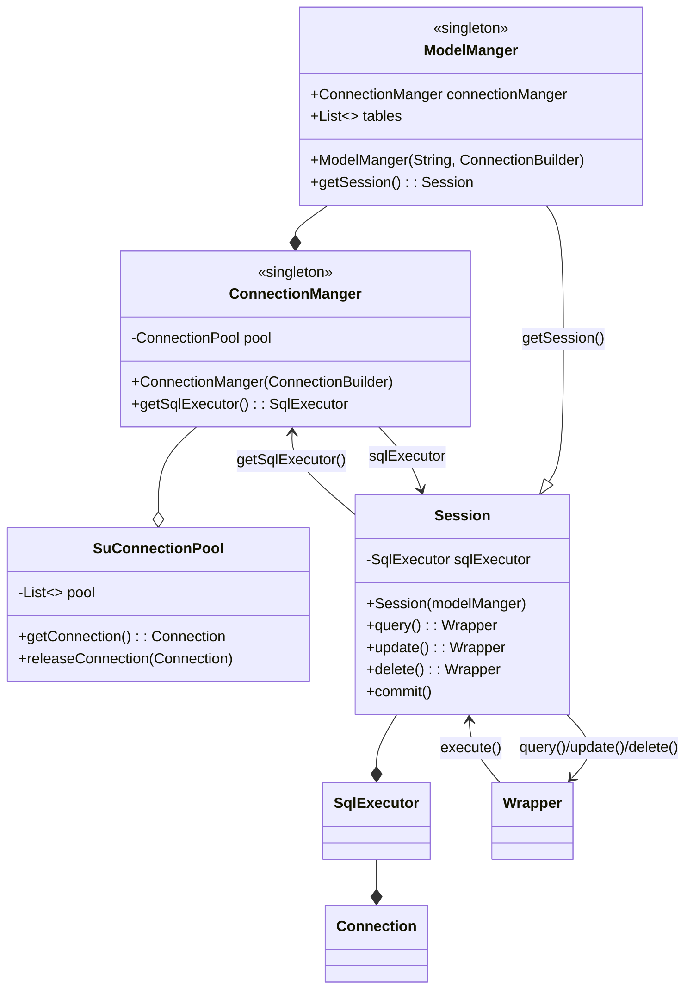

# SuOrm 框架

## `version 1.0.6`

# features

1. 简单的连接池设计
2. 使用回调函数的方式获取连接，可以支持多种数据库
3. 通过注解的方式定义表和字段
4. 支持用链式调用的方式添加查询条件
5. 事务支持

# usage

1. 定义模型类

    ```java
    @TableRegister("usersDAO")
    public class Users {
        @ColumnSetting(isPrimaryKey = true, isAutoIncrement = true)
        public int id;
        public String name;
        public String password;
    }
    ```

2. 初始化orm框架
    1. 新建`ConnectionBuilder`类
    2. 新建`ModelManger`类，传入待扫描的包和`ConnectionBuilder`的`getConnection`方法

        ```java
         ConnectionBuilder builder = new ConnectionBuilder(url, user, password);
 
         ModelManger modelManger = new ModelManger("top.suyiiyii.router.models", builder::getConnection);
         ```
3. 使用orm框架
    1. 获取`Session`
    2. 使用`Session`进行增删改查操作
    3. `commit`提交事务

        ```java
        // 获取Session
        Session db = modelManger.getSession();
        // 单个查询
        Student student = db.query(Student.class).eq("studentid", studentid).first();
        // 批量查询
        List<Student> list = db.query(Student.class).limit(page, size).all();
     
        // 单个插入
        student.studentid = "ididid";
        student.grade = 1000;
        db.insert(student);
     
        // 批量插入
        List<Student> students;
        for (int i = 0; i < 10; i++) {
             db.add(student);
        }
        db.commit();
     
        // 更新
        student = db.query(Student.class).eq("studentid", studentid).first();
        student.grade = 999;
        db.commit();
       
        // 删除
        db.query(Student.class).eq("studentid", studentid).delete();
        ```

# Tips

* RowMapper不能处理`null`值，请保证数据库中没有`null`值
* 建议一个项目只创建一个`ModelManger`实例
* 默认不启用事务
* 由于实现原因，需要实现一个作为主键并且自增的`id`字段
* 一个`Session`对应的是一个`Connection`
* 如果有修改，需要用`commit`方法提交

# 异常处理

调用`.first()`方法时，如果查询结果为空，会抛出`NoResultException`异常

# 主要类关系图

